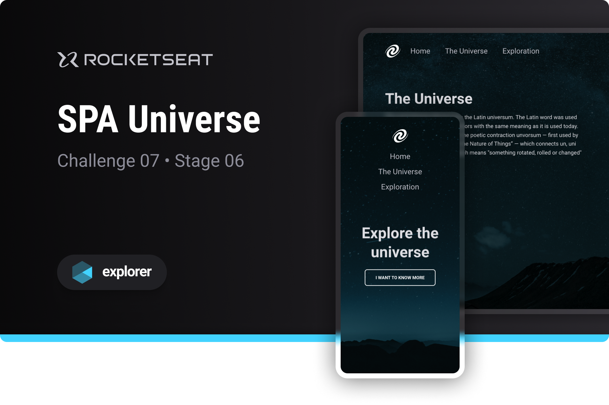

# SPA Universe

Challenge developed on Rocketseat's Explorer course

**SPA Universe is a single page application designed to put into practice JavaScript programming concepts**



## 🔗 Project Links

- 🎨 [**Figma**](https://www.figma.com/file/m8zp3mtxvwyTGQs69nIFM8/%5BDesafios-Explorer%5D-SPA-Universe/duplicate)

## 📋 Project information

- Rocketseat Explorer
- Stage 06
- Challenge 07

## 📝 Instructions for use

- Clone the project on your computer:

  ```bash
  git clone https://github.com/emanueltavecia/spa-universe.git
  ```

- Access the project folder:

  ```bash
  cd spa-universe
  ```

- Install dependencies:

  ```bash
  npm install
  ```

- Run the server:

  ```bash
  npm start
  ```

- Your default browser will open with the SPA Universe project

## 🧠 Concepts learned

The development of this challenge aims to put the following concepts into practice:

- SPA concepts
- Routes of an application
- Asynchronous JavaScript Programming
- Object Oriented Programming (OOP)
- Classes
- Local server with the lite-server library
- First concepts of Node.js

## 💻 Technologies


## 📄 License

This project is licensed under the MIT License - see the [LICENSE](./LICENSE) file for more details.
